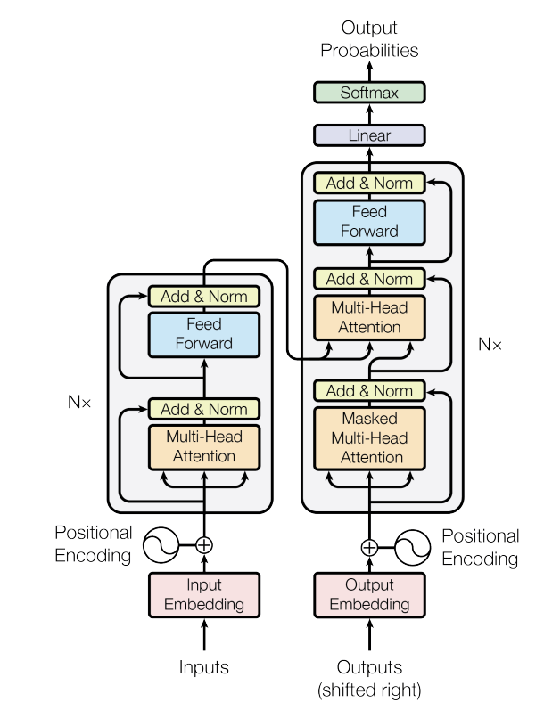

# **Transformer**


This is my personal implementation of [Attention is all you need](https://arxiv.org/abs/1706.03762)


### **Setup**
To set up the environment, follow these steps:<br>
1) ```conda create --name env pip```<br>
2) ```conda activate env```<br>
3) ```pip install -r requirements.txt```<br>

### **Usage**
In order to the models, open the notebooks ```run_transformer.ipynb```